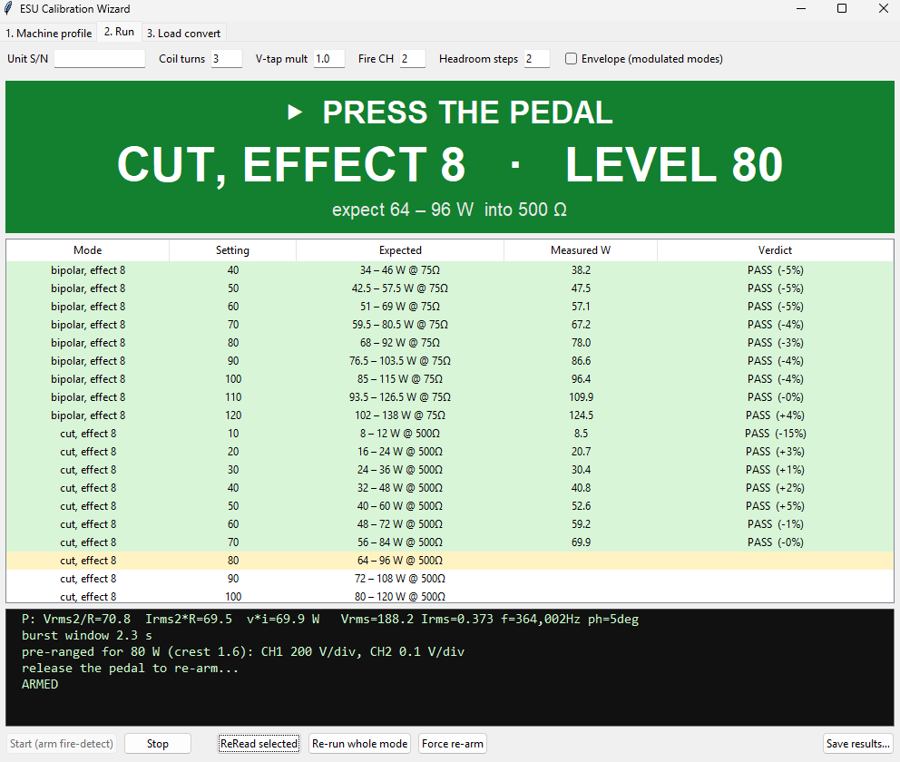

# Hantek DSO2000 ESU Output Tester

**Turns a general-purpose bench oscilloscope into an electrosurgical-generator output analyzer.**

An electrosurgical unit (ESU) is the generator behind the "bovie" pencil in almost every
operating room — it cuts and cauterizes tissue with a few hundred watts of RF. Its dial says
80 W. Hospital biomedical engineering has to periodically *prove* it still delivers 80 W into
a rated load, and document it. That job normally needs a dedicated ESU analyzer, a
single-purpose instrument that sits in a drawer between annual PMs.

This does the same job with a $200-class two-channel scope, a current monitor and a high-voltage
probe, driven over USB. It walks a technician through every mode and dial setting on the
machine, grades each point against the manufacturer's own spec table, and writes a signed-off
PDF report.



*Mid-run. The banner is readable from across the bench — the generator is usually on a different
table from the PC — and every row grades itself the moment the burst lands.*

What it hands back — [a sample report](refs/examples/example-report.pdf) (made-up machine, made-up readings; click a page for full size):

<p>
  
  
</p>

*Page 1 grades every point; page 2 puts every mode on one chart. Coag 70 fails on purpose.*

## Who this is for

- **A biomed tech running the test.** Double-click an exe, open the machine's profile, follow the
  colour: green = press the pedal, red = let go. No command line, no settings to remember.
- **A biomed engineer who wants their own.** The whole rig is three parts and the wiring is
  [documented below](#the-rig). The scope SCPI quirks are written down so you don't
  rediscover them.
- **An engineer reading the code.** One ~2,900-line Python file, standard library plus numpy and
  matplotlib, no framework. `python esu_test.py --demo` self-tests the math with no hardware.

## What it does

1. **Build a machine profile once** — mode × dial setting × load × expected watts, transcribed
   from the service manual into a CSV. Reused forever, shared over a network drive.
2. **Arm.** The tool watches the current channel and detects the generator keying on its own.
   Nobody counts down against a capture window.
3. **The tech presses the pedal.** One burst is captured, scaled, and turned into real watts.
4. **The point grades itself** — PASS/FAIL against the profile band, coloured, in the table.
   A bad reading is one button away from being re-taken.
5. **Save.** A PDF with the graded table and a measured-vs-spec chart, or the raw CSV.

## The parts that were actually hard

Honest engineering notes, each linked to the section that documents it:

| Problem | What it turned out to be |
|---|---|
| Readings "bounced all over the place" on coag and blend | Only *cut* is continuous wave. The rest are a 4 MHz carrier under a ~120 Hz envelope, and a window sized to show the carrier is 1/500th of one envelope period — so you measure whichever slice the trigger landed on. Same simulated 45 W signal read 6 W, 177 W, or 0 W depending on trigger position. [The fix](#modulated-modes-blend--coag--fulg--read-this-before-trusting-a-number) is one long window and a plain `mean(v·i)`; the three obvious fixes all fail, and why is written down. |
| The fire-detector armed at **12 kV** and nothing could trip it | A `:MEASure` query that times out is *not cancelled* — the scope still sends the reply, and the **next** query reads it instead of its own. One timeout poisons everything after it, across process boundaries. [Root cause and the four rules that came out of it](#when-the-scope-lies-about-a-measurement). |
| The scope's own `VRMS` measurement | Returns a **frequency** on firmware 1.0.8. So does `FREQuency` at an envelope timebase, and the `MATH` V·I trace reads zero on live RF. All three are proven dead on the bench and none of them are used — every number is computed from the raw trace. |
| Trusting any single power number | Every capture computes power three independent ways (`Vrms²/R`, `Irms²·R`, `mean(v·i)`). [When they agree the scaling is right; when they diverge, *which* pair diverges names the fault.](#the-trust-rule--read-the-three-power-numbers) |
| The manual specifies 75 Ω and the bench has 100 Ω | You cannot just rescale — it depends on how that generator regulates. So the tool [asks which model applies](#tab-3--load-convert-oddball-spec-load--a-load-you-can-build), shows all of them side by side, and stamps the derivation into the report. It never quietly guesses. |

## Status

Used on real Ellman and ERBE generators. The envelope method is verified **in simulation** to
0.0–1.6% on CW and modulated modes; the USB, detector and reporting paths are bench-verified
on a DSO2C50 (firmware 1.0.8). `--demo` runs the whole math and reporting chain with no scope
attached and is the regression test.

MIT licensed. Not a certified medical device and not a substitute for one where a calibrated
instrument is required — it is a bench tool that shows its work.

---

## The rig

Three parts, as built and used here:

| | Part | Notes |
|---|---|---|
| Scope | **Hantek DSO2C50** (DSO2000 series) | 2 ch, 50 MHz, USBTMC only — no LAN |
| Ch1 — voltage | **100:1 HV probe** across the load | Scope channel set to **100×**; 100:1 keeps a 1 kV ESU peak inside the probe's range and the scope's input |
| Ch2 — current | **Pearson 110A** current monitor | 0.1 V/A into 1 MΩ; run the ESU lead through it **3×** (`--turns 3`) to lift a small current off the noise floor |

That combination — DSO2C50 + Pearson 110A + 100:1 probe — is a DIY equivalent of a
BC Biomedical ESU-2050 analyzer.

> The DSO2000 firmware's SCPI is a stripped, quirky Rigol clone — no `:MEASure` subsystem, no screenshot,
> and waveform export is the undocumented `PRIVate:WAVeform:DATA:ALL?` with a 128-byte-per-packet header.
> This tool works around all of that. Waveform protocol adapted from
> [phmarek/hantek-dso2000](https://github.com/phmarek/hantek-dso2000).

---

## Quick start (any Windows PC)

**Option A — prebuilt exe, NO Python needed** (recommended for techs):
1. Download `esu_test.exe` from the [**Releases**](../../releases/latest) page.
   (Python and all libraries are bundled inside — nothing to install.)
2. Do the **one-time driver step** (below).
3. Double-click it → GUI opens.

**Option B — run from source** (needs Python 3):
```
pip install -r requirements.txt
python esu_test.py            # no args -> GUI
```

### One-time driver step (required, per PC)
The scope talks USBTMC, which needs a USB driver:
1. On the scope: **Utility → I/O → USB Device = Computer / USBTMC** (not Printer).
2. Install a USB backend — pick one:
   - **Zadig (recommended, offline):** run [Zadig](https://zadig.akeo.ie/), *Options → List All Devices*,
     select the scope's **USBTMC interface**, install **WinUSB**. `esu_test.py` bundles `libusb` so nothing else is needed.
   - **NI-VISA:** install the NI-VISA runtime; the script auto-detects it.
3. Confirm it's seen: `python esu_test.py --list`

---

## Bench setup

| Channel | Connect | Scope setting |
|---------|---------|---------------|
| **Ch1** | Voltage across the load via the **100:1 HV probe** | Set the channel **probe ratio to 100×** (match whatever probe you use) — the scope then reports true volts |
| **Ch2** | **Pearson 110A** current monitor (BNC), ESU lead through it 3× | Probe ratio **1×**; **DC coupling**; turn **V/div down** so the current fills several divisions |

Then edit the constants at the top of `esu_test.py`:
```python
PROBE_RATIO  = 1.0    # leave 1 if the scope's own probe setting scales CH1 voltage
COIL_V_PER_A = 0.1    # Pearson 110A: 0.1 (1 MΩ input) or 0.05 (50 Ω input)
CODES_PER_DIV = 25.0  # DSO2000 ADC codes/div — verify once with --calcheck
```

**Coupling = DC. Don't double-scale** (let either the scope's probe ratio OR `PROBE_RATIO` handle CH1, not both).
Current always needs `÷ COIL_V_PER_A` because the scope only shows volts.

---

## Usage

```
python esu_test.py                                   # calibration WIZARD (default on double-click)
python esu_test.py --sn ELLMAN123 --mode "cut 50W" --load 500 --setpoint 50 --turns 3
```

### Modes (pick one; default is the wizard)

| Flag | What it does | Example |
|------|--------------|---------|
| *(none)* | Launch the **calibration wizard** (also on double-click). See [Wizard](#the-calibration-wizard-for-techs) | `python esu_test.py` |
| `--wizard` | Force the wizard | `python esu_test.py --wizard` |
| `--gui` | The old one-shot capture-and-report window | `python esu_test.py --gui` |
| `--session` | **Power-sweep mode** — connect + autoscale **once**, then capture on each Enter with the scope held open. Logs to `<name>_sweep.csv`. Use this for a full sweep instead of one slow process per setpoint. See [Sessions](#sessions--sweeping-a-machine) | `python esu_test.py --session ellman 1234 cut --load 500` |
| `--envelope` | **Measure a modulated mode** (blend/coag/fulg) with a long-window `mean(v·i)`. Run on `cut` first to validate. **Combines with `--watch`.** See [Modulated modes](#modulated-modes-blend--coag--fulg--read-this-before-trusting-a-number) | `python esu_test.py --envelope --mode cutcoag --load 500` |
| `--compare` | **Score a saved sweep against an OEM spec table** and chart it. No scope needed. See [Comparing against OEM spec](#comparing-against-oem-spec---compare) | `python esu_test.py --compare ellman_1234_cut_sweep.csv` |
| `--watch` | **Fire-detect** — waits for the ESU to key, captures on its own, logs each burst, re-arms. No counting down against a capture. Watches the *current* channel (the only quiet one) and trips on **`:MEASure FREQuency` being nonzero at all** — no baseline, no threshold. Any `VPP` reply above what the ADC can physically produce at that range is discarded, not believed — see [the 12 kV threshold](#when-the-scope-lies-about-a-measurement). Names the candidate dial settings if a `--ref` table is loaded | `python esu_test.py --watch --load 500 --turns 3 --mode fulg --ref ellman-dento-surg-90-ffp` |
| `--watch --envelope` | The pair you actually want on a modulated mode: fire-detect **and** an honest long-window average. Burst 1 costs ~10 s (it hunts the carrier), every burst after ~6 s (the carrier is cached — it is a property of the machine, not the dial). A burst released too early is **DISCARDED**, not logged. Each burst prints how long the ESU was actually keyed | `python esu_test.py --watch --envelope --mode coag --load 500 --turns 3` |
| `--live` | **Live waveform window** — poll + redraw until you close it. Not true streaming (the DSO2000 has no streaming SCPI, only whole-frame reads → ~1–3 Hz), but enough to watch the wave change as you turn the dial | `python esu_test.py --live --load 200 --turns 3` |
| `--demo` | Self-test the math, no scope needed | `python esu_test.py --demo` |
| `--list` | List VISA resources + `*IDN?` | `python esu_test.py --list` |
| `--calcheck` | Capture + print raw scope-volts / noise / ADC codes to verify scaling | `python esu_test.py --calcheck` |
| `--probe` | Dump the waveform packet structure (reassembly diagnostic) | `python esu_test.py --probe` |

### Report options (the main capture-and-report path)

| Flag | Default | What it does | Example |
|------|---------|--------------|---------|
| `--sn` | `?` | ESU unit serial number (report header + output filename) | `--sn FORCEFXC` |
| `--mode` | `?` | Mode label. In a session it's the starting mode and is logged per row — use a name your reference table knows (`cut`, `hemo`, `bipolar`…) if you plan to `--compare` | `--mode cut` |
| `--setpoint` | `?` | Front-panel setting (for the report) | `--setpoint 50` |
| `--ref` | `esu_reference.csv` | OEM table used by `--compare`. One file per machine model | `--ref refs/bovie_a1350.csv` |
| `--load` | `500` | Load resistance in ohm — **must be the real value**, the `Vrms²/R` and `Irms²·R` powers depend on it | `--load 200` |
| `--turns` | `3` | Passes of the ESU wire through the Pearson coil. Coil reads amp-**turns**, so N turns = N× signal off the noise floor; amps are divided back by N in software | `--turns 3` |
| `--cycles` | `6` | Approx # of waveform cycles autoscale puts on screen (snaps to nearest scope timebase gear) | `--cycles 5` |
| `--no-autoscale` | off | Skip auto V/div + timebase; use the scope exactly as set | `--no-autoscale` |
| `--acq` | `HRESolution` | Acquisition type: `HRESolution` \| `AVERage` \| `PEAK` \| `NORMal` (HRES cuts noise; use `NORMal` for one-shot bursts) | `--acq AVERage` |
| `--count` | `64` | Number of averages when `--acq AVERage` | `--count 128` |
| `--smooth` | `0` | Display-only moving-average on the current plot (samples); does **not** touch the RMS/power numbers | `--smooth 10` |
| `--resource` | auto | Explicit VISA resource string (default: autodetect USB) | `--resource USB0::...::INSTR` |
| `--out` | `esu_report.html` | Output HTML path (`.png` written alongside) | `--out force_fxc.html` |

Output: `esu_report*.html` (embedded plot + measurements, **Ctrl+P → Save as PDF**) and a `.png`.
The report flags **low ADC resolution** if a channel's signal spans under ~10 codes (turn its V/div down, or `--turns` more).

## Sessions — sweeping a machine

A session holds the scope open so you can walk the dial without a reconnect + re-autoscale
per point. Name it after the machine you're testing:

```
python esu_test.py --session ellman 1234 cut --mode cut --load 500 --turns 3 --no-autoscale
```

Words after `--session` are joined into the filename, so no quoting needed:
`--session ellman 1234 cut` → **`ellman_1234_cut_sweep.csv`**.

At the prompt:

| Type | Does |
|------|------|
| `50` | Capture at dial setting 50 |
| `m hemo` | **Switch mode** — later captures are logged as `hemo` |
| `l 200` | **Change the load** in ohm (bipolar needs 200, not 500) |
| `a` | Re-autoscale |
| `q` | Quit |

**Yes, you can change modes inside one session.** Each row carries its own `mode` and
`load_ohm`, so one file per *machine* is the intended unit — sweep cut, then `m hemo`, then
`m bipolar` + `l 200`, all into `ellman_1234_sweep.csv`. `--compare` grades each mode against
its own curve and plots them as separate series. The `--mode` / `--load` flags just set the
starting values.

> Changing mode does **not** change the load. Bipolar is tested at 200 Ω while everything
> else is 500 Ω — use `l 200` when you switch, or every bipolar row is graded against a
> load you weren't using.

### Redoing a bad reading

**Named session → re-capturing a setting overwrites it.** Type `70` again and the new
reading replaces the old row *in place*, keeping your sweep order. You'll see:

```
overwrote earlier capture at cut 70 (12.3 W -> 89.6 W)
```

The dedupe key is (mode, setting), so `cut 70` and `hemo 70` don't collide. Existing files
are reread on startup, so quitting and resuming keeps overwriting instead of duplicating.

**Bare `--session` → append-only.** Every capture is kept, nothing overwritten — for
debugging, repeatability checks, or watching a reading drift as something warms up.

## Comparing against OEM spec (`--compare`)

Grades a saved sweep against a manufacturer's power table and charts it. Runs offline:

```
python esu_test.py --compare ellman_1234_cut_sweep.csv
python esu_test.py --compare bovie_a1350_sweep.csv --ref refs/bovie_a1350.csv
```

```
ellman_1234_cut_sweep.csv  vs  esu_reference.csv  [Ellman Surgitron 4.0 Dual RF/120 IEC]
mode        set   meas W   spec W           window     dev   result
cut           5     12.8     12.5   10.0-15.0       +2.8%   PASS
cut          15     31.9     35.0   28.0-42.0       -8.8%   PASS
cut          50     74.6     87.0   69.6-104.4     -14.3%   PASS
cut         100    106.1    123.0   98.4-147.6     -13.8%   PASS

20/20 within tolerance
Chart -> ellman_1234_cut_sweep_vs_spec.png
```

The chart draws the spec curve, a shaded ±tolerance band, and your points — circles for
pass, **X** for fail.

### The reference table — one file per machine in `refs/`

`--ref` takes a **bare machine name**, resolved as `refs/<name>.csv`, or an explicit path:

```
python esu_test.py --compare fxc_1234_sweep.csv --ref force-fxc
python esu_test.py --compare blend_sweep.csv                      # default: ellman-surgitron-4.0
```

A name that doesn't exist lists what does, so a typo can't silently grade zero rows.

```csv
model,mode,setting,load_ohm,expected_W,tol_pct,envelope,wiring
Ellman Surgitron 4.0 Dual RF/120 IEC,cut,50,500,87,20,0,Active -> right MONOPOLAR jack; return -> REM jack
Ellman Surgitron 4.0 Dual RF/120 IEC,bipolar,50,200,87,20,0,Both leads -> the two BIPOLAR jacks
Ellman Surgitron 4.0 Dual RF/120 IEC,fulg,50,500,87,20,1,Active -> right MONOPOLAR jack; return -> REM jack
```

`envelope` and `wiring` are **optional** and both default to today's behaviour when absent, so
every profile written before they existed still loads.

`envelope` (`1` or `0`) moves the "is this a modulated mode?" decision out of the tech's head and
into the machine's own table — **it is not auto-detection**, it is you reading the service manual
once, per machine. A mode is modulated or it isn't, so there is no third state and no runtime
switch on the run tab to contradict the profile. The tool does check itself afterwards, though:
a row captured `direct` whose own window turns out to straddle an envelope is flagged
**⚠ MODULATED — re-read as envelope** rather than graded PASS or FAIL, because at that point the
number is whatever the trigger landed on.

`wiring` is free text the run banner shows, shouting **CHANGE THE LEADS** whenever it differs
from the previous row.

Format, how to add a machine, and the front-panel-vs-manual naming trap: **`refs/README.md`**.

**Sweep at any granularity.** `expected_W` is *interpolated* along the curve, so settings at
5, 15, 45 grade fine against a table listing only 0, 10, 20… Tolerance and load interpolate too.
Settings past the ends of the table are **reported as skipped, never extrapolated**:

```
SKIPPED 2 row(s) not covered by refs/surgitron.csv: modes=['cut'], settings -5-120
reference covers: bipolar 0-100, blend 0-100, coag 0-100, cut 0-100, cutcoag 0-100, fulg 0-100, hemo 0-100
```

A mode name that isn't in the reference skips loudly too.

### What gets graded

`P_meanVI` — `mean(v·i)`. It's the only estimate that neither divides by your typed load nor
assumes the load is purely resistive, so it stays right when the other two drift. Sweeps
written before this feature have no `mode` column; pass `--mode cut` and it fills it in.

## Modulated modes (blend / coag / fulg) — read this before trusting a number

Only **CUT** is continuous wave. Every other mode is a 4 MHz carrier under an envelope, and a
capture sized to show the *carrier* is far shorter than one *envelope* period. You then measure
whichever slice of the envelope the trigger landed on. Same simulated signal (true average
**45.0 W**), four trigger positions:

```
window at  0.5 ms ->   6.25 W    (14% of true)
window at  4.0 ms -> 176.77 W   (393% of true)
window at  8.3 ms ->   0.03 W     (0% of true)
window at 12.0 ms ->   0.00 W     (0% of true)
```

That's the "bouncy, all over the place" reading. The tool now warns when it detects this:

```
WARNING: envelope varies 64% across this capture -- the window is shorter than the
         modulation period. Vrms and power are whatever the trigger landed on, NOT
         average power.
```

**A frequency readout that isn't ~4 MHz is the same symptom.** All Ellman modes use a 4.0 MHz
carrier (§3.1); `f=989100Hz` means the counter is chewing on a gated carrier, not that the
carrier moved.

### Three things that look like fixes and aren't

| Tempting | Why it fails |
|----------|--------------|
| `--acq HRESolution` | HRES boxcar-averages raw samples per point. At a slow timebase that low-passes the 4 MHz carrier to nothing — measured **0.00% of true** in simulation. Use `--acq NORMal`. |
| Just slow the timebase | 4.000 MHz divides *exactly* into every 1-2-5 scope rate (÷32 at 125 kSa/s, ÷16 at 250 k, ÷8 at 500 k, ÷4 at 1 M). You sample the identical carrier phase every time — coherent sampling, answer can be anything including zero. |
| Average many captures | Converges, but slowly: 500 frames still scatters **±7%**. Not worth 500 USB transfers. |

### What actually works — `--envelope`

**One long window, plain `mean(v·i)`.** V and I are sampled *simultaneously*, so `v(t)·i(t)` is
correct at every instant no matter how badly the 4 MHz carrier is aliased. Average over a window
spanning many modulation periods and the carrier phase averages out along with the envelope.
No peak detect, no `/2`, no phase correction.

```
python esu_test.py --envelope --mode cut --load 500 --turns 3      # validate first
python esu_test.py --envelope --mode cutcoag --load 500 --turns 3

  in-burst carrier: 3,999,533 Hz, phase 3 deg
  long window: 80.0 ms, 50 kSa/s, acq=NORMal, 319,963 carrier cycles averaged
  P (mean v*i, long window) = 43.1 | 43.4 | 43.2  ->  43.2 W   (spread 0.3%)
```

**Speed.** One deep capture replaces the three shallow ones this used to take, the carrier is
measured once per machine rather than once per setpoint, and V/div is re-ranged only when
clipping is actually detected instead of before every reading. Measured on a DSO2C50:
`autoscale` alone costs **12.8 s** and used to run twice per reading. Net **~34 s → ~5.5 s per
sweep point** (the first point still pays ~20 s for the carrier hunt), on 3.3× more envelope
data — 800 ms of record instead of 3 × 80 ms. `--envdepth` sets the depth, `--recarrier` forces
the carrier to be re-measured.

Accuracy vs known truth (simulated at 50 and 125 kSa/s, with a 3,999,533 Hz carrier and 13° stray C):

| Mode | Envelope | Error |
|---|---|---|
| cut | CW | +0.1% |
| blend (`cutcoag`) | full-wave, 120 Hz | +0.1% |
| coag (`hemo`) | half-wave, 60 Hz | −0.0% |
| fulg | 10% square burst, 400 Hz | +0.1% to +1.6% |

**It runs 3 captures and reports the spread.** Agreement is the only honest validation — the one
real failure mode is *coherent sampling* (sample rate dividing the carrier exactly, so every
sample lands at the same phase), and repeatability is what catches it. Over 5% spread warns.

**Validate on CUT first.** The method is exact on CW, so on cut it must reproduce your normal
reading. If it does, it's trustworthy on blend/coag on *your* bench — that's the argument that
makes a report defensible.

**The carrier hunt is a diagnostic, not a gate.** Before the long window, one 14 µs capture
resolves the carrier — for the report line and for the coherent-sampling check. `mean(v·i)`
does not use it. On a low-duty mode that peek lands *between* bursts most of the time (`fulg`
at ~10% of a 2.5 ms period: one try hits 11%, so six tries miss outright **51%** of the time),
and it used to throw the whole burst away with `never caught an in-burst carrier in 6 tries`.
Three things now prevent that:

- **A `direct` capture already resolves the carrier for free** — it sits on a carrier-length
  window — so the first `direct` point of a run primes the cache and the envelope points never
  hunt at all. The carrier is a property of the machine, not of the dial setting.
- **Failing the hunt is no longer fatal.** It warns, measures, and reports the frequency as
  unknown. *"Was the pedal actually down?"* is answered on the long window instead, where a
  keyed ESU cannot read near zero at any setting — a far better test than a 14 µs peek.
- **A failed hunt is remembered for the run.** It fails for a reason that cannot change
  mid-run — the mode's duty cycle — so re-paying six captures on every burst to re-learn "no"
  was pure cost. Three tries, once, then never again (`--recarrier` forces a fresh hunt). That
  is most of the difference between a ~17 s burst and a ~7 s one.

> ⚠️ **`:ACQuire:TYPE PEAK` is NOT honoured by fw 1.0.8.** An earlier version of this feature
> assumed peak detect worked and reconstructed the envelope from it. The scope silently returned
> ordinary decimated samples, so it read **exactly half** on CW (`mean(|V|·|I|)/2` where
> `mean(|V||I|) == mean(V·I)` for in-phase sines) and reported a fake ~600 Hz "envelope" that was
> really the carrier's alias beat. The tell was **duty ≈ 0.5 on a CW signal**, which is just the
> sine statistic `mean(V²)/Vpk² = 0.5`. Acquisition type and timebase are now both read back.

### The brute-force alternative

1. **Find the envelope period first.** `--acq PEAK`, slow timebase, watch how fast the envelope
   repeats. You can't size the window without this number, and it differs per mode.
2. **Size one capture to span ≥3 envelope periods** while keeping the sample rate ≥10× the
   carrier (≥40 MSa/s). That means raising `:ACQuire:POINts` — deep memory is the only way to
   get both, and the transfer is slow.
3. **Verify by repeating.** Capture 5×. If the numbers agree within a few %, the window is long
   enough. If they scatter, it isn't — nothing else you do to the math will fix that.

Until a mode passes step 3, don't log its numbers as a measurement. **CUT is unaffected** — it's
CW, so there's no envelope to straddle.

## The trust rule — read the three power numbers
Every report computes power three independent ways: `Vrms²/R`, `Irms²·R`, and `mean(v·i)`.
**When all three agree, the scaling is correct and the number is real.** When they diverge,
one channel is mis-scaled and the divergence tells you which:
- `Irms²·R` way off, others low → **CH1 voltage probe ratio wrong** (e.g. a ×10 probe left on ×1 → voltage reads 10× low). Fix it on the scope; the tool trusts the scope's own probe ratio.
- `Vrms²/R` vs `Irms²·R` disagree → the load `R` isn't its nominal value (heating/drift) or there's reactance.

**The tool now does this reading for you.** When the three split by more than 15% it resolves the
measured impedance into its parts and names the cause, because a rig fault written down as a
machine fault is the expensive kind of mistake:

```
  !! the three power numbers DISAGREE: Vrms^2/R=36.2  Irms^2*R=23.8  v*i=24.1 W
     V and I are 35 deg apart, so this is not the pure resistance the spec assumes:
     |Z| 61.6 ohm = 50.6 REAL + 35.1 reactive   (profile says 50 ohm)
     The REAL part matches the profile -- which is why Irms^2*R and v*i agree, and why
     24.1 W is the power. Vrms^2/R reads high only because Vrms also counts the volts
     across the reactance.
     Look at the RIG, not the machine: HV probe compensation at this carrier, and
     lead/load inductance.
```

`Vrms²/R` assumes every measured volt sits across `R`; `mean(v·i)` and `Irms²·R` do not. So a
V–I phase angle splits them by exactly `cos φ`, and **which** number is the odd one out says
where to look. Real case (ERBE 200S soft coag, three consecutive settings): the real part came
out 50.6 / 50.6 / 50.4 Ω against a 50 Ω profile — constant to 0.4% while the reactance fell from
35 to 26 Ω. The load was right, the power was right, and the voltage path had something in it.
- Clean voltage + near-zero current → the current loop is **open** (or both conductors pass through the coil and cancel).

## Why low settings read high (and take longer)

`Vrms = sqrt(mean(V²))`, so anything that isn't signal adds **in quadrature**. The scope's own
noise floor is a fixed number of ADC codes whatever the range, so the less of the ADC the signal
uses, the more it inflates every rms-derived number — and `Vrms²/R` and `Irms²·R` are squared,
so they inflate twice as fast:

| peak codes used | Vrms high by | `Vrms²/R` high by |
|---|---|---|
| 75 (correctly ranged) | 0.1% | 0.1% |
| 40 | 0.2% | 0.5% |
| 20 | 1.0% | 2.0% |
| 10 | 3.9% | 8.0% |
| 5 | 14.8% | 31.8% |

*(assuming a ~2-code RMS floor — `--calcheck` measures yours.)*

**Three things pushed low settings into that column, all now fixed:**

- **`clip_warn` was one-sided.** It caught *too sensitive* (railed, reads low) and *past the
  screen edge but valid*, and said nothing at all about *too coarse* — the one that reads
  **high** and is otherwise silent. It now reports peak codes used and the resulting inflation.
- **The crest hint's bias was backwards.** `predict_vdiv` ranges the first burst of a mode from
  `--crest-hint`, and the two ways to be wrong are **not symmetric**: guess too low and the
  frame rails, which `clip_warn` catches and re-ranges on the spot; guess too high and the range
  is silently too coarse. The old default 3.5 "split the difference" between cut (1.41) and fulg
  (4–6) — which put every CW-ish mode's first burst at ~25 of 127 codes. Now **2.0**, erring
  toward the self-correcting side.
- **DC was never removed.** An ESU delivers no DC and a Pearson coil *cannot pass* DC, so any
  DC in the trace is scope baseline error — but `mean(v·i)` gained `Vdc·Idc` **outright**. That
  is a fixed watt offset: invisible at 100 W, a real error at 10 W, on the exact number the
  wizard grades against. Now subtracted, and reported as `P_dc_removed` so a suspect reading can
  be traced rather than re-argued.

**Why it also takes longer:** a mis-ranged first burst is a railed first burst, and railing costs
an autoscale plus a re-capture. Both are per-mode, not per-setting — the second burst of a mode
is ranged from the crest that mode actually measured — but a sweep that walks upward from the
bottom spends them at its low settings.

## Finding the right load
ESU power peaks at a rated load and rolls off both sides (too low = current-limited, too high = voltage-limited).
Sweep `--load` and watch `P (mean v·i)` climb toward the dial; the peak is the mode's rated impedance.
(Force FX-C bipolar Standard: ~100–200 Ω works; 50 Ω and 500 Ω both under-deliver.)

## The calibration wizard (for techs)

Double-click the exe. Three tabs, no command line.

### Tab 1 — Machine profile
A profile is just a `<machine>.csv` — the **same format** `--compare` and `--watch --ref` already read. Build one once per machine model, keep it anywhere (a shared drive works), reuse it forever. Nothing is bundled in the exe.

1. **Open…** → pick a profile file, or start empty. The dialog remembers the last folder.
2. **Add a mode**: name it, give the setting range and step (e.g. `10 to 120 step 10`), give the load. Ellman Dento-Surg is four calls: `cut 0–10 @500Ω`, `cutcoag 0–10`, `coag 0–10`, `fulg 0–6`. A Force FX-C would be the same at `300Ω`.
3. Pick the **spec style your manual uses** — the wizard takes either:
   - **min – max** (Ellman prints "25 – 37 W")
   - **nominal ± %** (Valleylab prints "31 W ± 19.4%")

   Both store the identical band, so the same machine grades the same either way — asserted in `--demo`. Flip the radio button to *read back* a table in the other style.
4. Select the row(s) a spec applies to, type the numbers, **Apply**. The two fields follow the style (Min/Max or Nominal/± %); leave a field blank to keep that value, e.g. only ± % to change the tolerance on a run of rows.
5. **Save…** → choose where. A shared drive keeps one copy per machine model for the whole bench.

### Tab 2 — Run
Fill S/N, coil turns, tap multiplier. Leave **Envelope** ticked for anything but pure cut.

**Start** arms the fire-detector (~8 s of silence to baseline — *do not fire*). Then it is hands-free, and the **banner tells you what to do with the pedal by colour** — readable from the other table:

| Banner | Do this |
|--------|---------|
| 🟨 **BASELINING — DO NOT FIRE** | hands off, ~8 s |
| 🟩 **▶ PRESS THE PEDAL** | set the dial to what the banner shows, then key it |
| 🟦 **■ HOLD IT — CAPTURING** | keep it keyed, don't touch anything |
| 🟥 **✋ RELEASE THE PEDAL** | let go; it re-arms on its own |

Under that, in the biggest type on the screen: **CUT · LEVEL 3**, and the expected band beneath it.

- The row fills in with measured watts and **PASS/FAIL vs the profile**, green or red, and it aims at the next point on its own — **downward from the point you just took**, never back to the top. Green rows are stepped over; unread and red ones are not. So to test only `cut`, ReRead its first row and it walks that mode instead of snapping back to row 0 after every burst.
- Once nothing below wants a burst it wraps, and the **wrap looks for unread rows only**. A red row is re-offered on the way down, but a genuinely out-of-spec point can never become the permanent target and trap the run on itself. A `direct` row that turns out to have straddled an envelope goes **amber, ⚠ MODULATED — re-read as envelope** instead of green or red — that number was one slice of a burst, so neither verdict would have meant anything.
- If the profile's `wiring` column is filled in, the banner carries it, and flips to **⚠ CHANGE THE LEADS** the moment it differs from the row above — so re-plugging bipolar → monopolar is prompted, not remembered.
- **ReRead selected** → clears that row, aims back at it, **and re-ranges the scope for it immediately**. Jump from setting 9 back to setting 2 and the vertical scale follows before you touch the footswitch, rather than staying on setting 9's range until the next burst.
- **Re-run whole mode** → clears every row of that mode and starts it over.
- **Force re-arm** → escape hatch if it thinks the pedal is still down when it isn't.
- **Save results…** → a file dialog (remembers the last folder), default `<machine>_<sn>_results.pdf`: the graded table (spaced, gap between modes) with the measured-vs-spec chart after it — each mode its own marker shape, fill and line dash, so it reads on a black-and-white printout. Pick *CSV* in the type box for raw data instead. The table's mode column is sized from the data,
so a long name (`bipolar, effect 8`) shifts the header with it instead of sliding the numbers out
from under it.

  The two pages at the top of this README are exactly that, off [`example-minmax.csv`](refs/examples/example-minmax.csv).

### Tab 3 — Load convert (oddball spec load → a load you can build)
An ERBE 200S is specified into **75 Ω**. A series-bypass load bank with a hardwired 100 Ω base
cannot make 75 Ω at all, so the spec has to be restated at a load you have — say 100 Ω.

**This is an assumption, not arithmetic.** An ESU is not a fixed source: what it delivers into
100 Ω when the manual specified 75 Ω depends on how that generator regulates. So the tab shows
what **every** model says and makes you choose:

| Model | P at the new load | Use it when |
|---|---|---|
| **power-regulated** | unchanged | the manual's power-vs-load diagram is flat across both loads (common on modern units) |
| **manual's curve** | read off the diagram | **the rigorous one** — type a few `R:W` points for that mode, e.g. `50:80 75:100 100:95` |
| **matched source** | `P × 4·Rs·R/(Rs+R)²` | the spec load is the design match point; mild correction, derates either direction |
| **voltage source** | `P × Rs/R` | the voltage-limited region (low settings on many units) |
| **current source** | `P × R/Rs` | the current-limited region |

For 75 → 100 Ω those span **×0.75 to ×1.33** — a 120 W bipolar spec becomes anywhere from 90 W
to 160 W. When the models disagree by more than the tolerance you are grading against, the tab
says so in red. Get the diagram, or measure one setting at both loads on a known-good unit.

Pick the mode(s), type the target Ω, pick a model, and **Write converted profile…** saves a
*separate* file (`<machine>-100ohm.csv`). Tolerance is left alone — the model moves the expected
value, it does not widen the window. The `model` column records what was done
(`ERBE 200S [bipolar spec restated at 100Ω, regulated model]`), so every PDF off that profile
says on its face that it is derived.

### When the scope lies about a measurement
`refs/dso2c50-scpi-commands.md` records that fw 1.0.8 returns a *frequency* for `VRMS` (16670 / 25000 / 5556 against real volts) and desyncs its `:MEASure` reply buffer when other queries are interleaved with it. That is not a curiosity — one 4000 V "idle" reading on CH2 set the fire-detect threshold to **12 kV, ~8×10¹¹ W into 500 Ω**, and armed a detector nothing could ever trip.

**The root cause, found 2026-09-10:** a `:MEASure` query that times out is *not cancelled*. The scope still produces that reply — it just arrives after `scope_meas` stopped listening, and the **next** query reads it instead of its own answer. One timeout poisons everything after it. And the queue outlives the process: a fresh run's `*IDN?` came back as `2.000e-03` (the previous run's orphaned CH2 Vpp) and `1.190e+03` (an orphaned `FREQuency`).

That is where the 4000 V/div, the 12 kV arm threshold and the 320 V one all came from — not from three separate bugs.

The fix is **`drain()` (USBTMC Device Clear) on every timeout**, plus a *deep* drain at `connect()` — Device Clear alone, then read off and discard whatever arrives — before an `*IDN?` that is also validated — an IDN has letters in it, a stale measurement doesn't. `scope_meas`'s timeout went 2 s → 3 s so there are fewer timeouts to clean up after.

**If the link ever wedges**, `python esu_test.py --list` is the unstick command — connecting now deep-drains before it does anything else.

Four rules follow, and all are enforced in code:

- **Drop the orphan immediately.** Any failed `:MEASure` calls `drain()` before returning `None`.
- **Never mix text and binary in the queue.** `capture()` reads every scale and offset it needs *before* the waveform block read, drains, transfers, then drains again before the next text query. A `.query()` issued after a block read decodes the leftover samples and dies with `'ascii' codec can't decode byte 0x80 in position 94` — 0x80 is a waveform sample, not text.
- **A half-delivered frame is restartable, not fatal.** Device Clear does not always abort a block transfer the scope has already begun, so a process that dies mid-waveform leaves the rest of that frame queued for whoever connects next. `capture()` detects joining at a nonzero offset (the channel-enable header rides only on the `off == 0` packet), deep-drains, and restarts the frame — up to 3 times, then says plainly that the USB link needs replugging. Before this it unpacked a `None` header and reported `a bytes-like object is required, not 'NoneType'`.
- **A bare number is never an identity.** `looks_numeric()` parses the `*IDN?` reply as a float; if it parses, it's a stray measurement and the queue gets cleared and re-asked, up to four times. Testing `any(c.isalpha())` does not work — `1.316e+03` contains a letter.

- **Never alternate `:MEASure` with ordinary queries.** Batch all the measurements, `scope.clear()`, then the plain queries. `range_by_vpp` does exactly this; the detector does no plain queries at all. Both `--watch` and the wizard clear the buffer once before polling starts.
- **The tell is internal inconsistency.** CH2 reporting 4000 V/div *while measuring 0.002 V Vpp on the same channel* is impossible — 4000 is the answer to `:ACQuire:POINts?`, handed back late. If two readings can't both be true, one is stale.
- **A reply physics rules out is thrown away.** `level()` returns `None` (not `0.0`, so it can't read as "pedal released" either).

### The detector asks the scope one question: is there a frequency?
An idle channel measures **no frequency at all**. Bench-verified on the DSO2C50, 2026-09-10, CH2, 8 runs of 5 polls:

| | reading |
|---|---|
| not firing | `0.0`, every time |
| firing | 1351 / 1786 / 1852 / 1923 / 2273 / 2941 Hz, every time |

Those keyed numbers are aliased nonsense — the detector sits at the envelope timebase, where a 0.3–4 MHz carrier is ~80× undersampled. But the *value* was never the question. **Existence is.**

So there is no baseline to sit through, no threshold to derive, no idle floor to measure, no V/div to know — and nothing left that a desynced reply can corrupt into a 12 kV trip level. Every one of those bugs lived in machinery that only existed to turn a voltage into a yes/no. This is strictly less code doing a strictly more reliable job.

Two guards remain, both cheap:

- **`--fire-min-hz` (default 100).** Only there to reject a stale VPP reply leaking into the queue — orphans are volts (0.002 … a few), keyed readings are kilohertz, and the two never overlap.
- **`None` is never "idle".** A dropped query means *unknown*; the release wait needs **two consecutive** genuine `0.0` readings, so one timeout can't re-arm mid-burst.

`--fire-item VPP` puts the old level-based path back (median idle × `--fire-gain`, with a physics bound from `--max-watts`/`--load`/`--turns`) if `FREQuency` ever misbehaves on a different scope. `--demo` asserts both paths against the eight real readings above.

### Keeping the burst short
Every second in a burst is a second the ESU is dumping into the load, and a hot heatsink is measuring a different machine than a cold one.

**The ranging that never happens is the fastest ranging.** Measure-step-remeasure costs 2–5 s with the pedal *down*, and it is solving for a number already sitting in the profile: the wizard is testing a named mode at a named setting whose expected output it knows. So the ranges are computed and written **while the pedal is still up**:

```
Vpeak = crest · √(P·R) / vmult          ->  CH1 V/div, peak at 3 of 8 divisions
Ipeak = crest · √(P/R) · 0.1 · turns    ->  CH2 V/div
```

No query, no iteration. `--watch` fills the expected watts from the `--ref` table, the wizard from the profile, or `--expect-w` sets it by hand. Being wrong is cheap and self-correcting — `clip_warn` catches a railed frame and re-ranges the old way for that one burst.

`crest` (peak/rms) is the only guess: cut is 1.41, coag and fulg run 4–6, so `--crest-hint` (3.5) covers the **first** burst of a mode and every burst after uses the crest that mode actually measured. It converges after one reading.

That takes the keyed window to roughly:

| | before | after |
|---|---|---|
| first burst of a machine | ~10 s | ~5.5 s (still hunts the carrier) |
| every burst after | ~6 s | **~3.5 s** — just the capture |

Three further things keep it down:

- **Ranging is done with `:MEASure:VPP`, not a waveform capture.** `autoscale()` pulls a full 4K frame per pass (~2.3 s each) just to compute a peak. VPP is one query (~1 s), and it's the one `:MEASure` item proven alive on fw 1.0.8 — the fire-detector already runs on it. Read on the long envelope window it's also *more* correct than the old fast pass, which ranged off whatever point of the envelope a 14 µs slice happened to land on.
- **`--envdepth` defaults to 10000 — a 200 ms record, ~2.9 s.** 200 ms is not arbitrary: it's exactly **12 mains periods at 60 Hz and 10 at 50 Hz**, so a mains-locked envelope fits a whole number of periods either way and there's no partial-period error. That's why 200 ms is exact and 120 ms isn't — 120 ms is 7.2 periods at 60 Hz and reads ~1.5% high on half-wave coag with the thirds disagreeing 16%. `--demo` checks 800/400/200 ms against a 4-second reference for both full-wave blend and half-wave coag, and checks that 120 ms *does* trip the warning.
- **The memory depth isn't restored between bursts.** Writing `:ACQuire:POINts` costs a 0.6 s settle, and paying it on every burst means paying it with the pedal down. It's put back once when the run ends.

### Ranging while you walk a dial up
A range that fitted setting 3 clips at setting 4 — a 0 → 10 walk only ever goes up. Two things handle it:

- **Every burst re-ranges before it measures.** Only the carrier *frequency* is cached between bursts (it's a property of the machine); V/div is a property of the dial setting and is re-measured each time.
- **`Headroom steps` (default 2, `--headroom` on the CLI)** backs the *voltage* channel off two 1-2-5 range steps after each burst, so the next press doesn't slam into the top of the screen before the autoscale runs. It can't accumulate, because the next measurement re-ranges anyway.

The **current** channel deliberately gets *no* headroom. It's the fire-detector, and it trips on ~3 ADC codes: at 50 mV/div that's ~1.8 W into 500 Ω, but two steps coarser it'd be ~29 W and every low setting would sail past unnoticed. So CH2 *will* look clipped on the scope when you key a high setting — that's the trigger, not the measurement, and the real capture re-ranges before it reads anything.

Every warning the CLI prints (clipping, envelope-window too short, coherent sampling) shows up in the black log pane — the exe has no console, so nothing is lost.

---

## Build a portable exe (Windows)

```
build.bat
```
Produces a single `dist\esu_test.exe` (Python + all libs + `libusb` bundled). Copy it anywhere;
each target PC still needs the one-time driver step above. No machine profiles are bundled —
the wizard opens and saves them through a file dialog. Last-used folders: `%USERPROFILE%\.esu_test.json`.

**`build.bat` is the only source of truth for the build.** `esu_test.spec` is *regenerated* by
it on every run and is gitignored — editing the spec has no effect.

It fails loudly now, which it did not before:

- **`--noconfirm`.** PyInstaller prompts `output directory ... will be REMOVED! Continue? (y/N)`
  whenever `dist\` already exists, and defaults to **N**. The build aborted and the script
  printed `Done.` anyway, so every rebuild after the first silently did nothing.
- **The old exe is deleted first**, so a failed build can't leave the previous one looking fresh.
- **`python -m PyInstaller`**, not the bare `pyinstaller` console script, which isn't always on
  PATH even when installed.
- **Every step checks `errorlevel`** and stops with a specific message, in parenthesised blocks —
  `if errorlevel 1 echo x & exit /b 1` is a trap, because cmd splits at `&` and runs the `exit`
  whether the `if` fired or not.
- **CRLF line endings.** cmd.exe mis-parses multi-line `if (...)` blocks in a LF-only `.bat`.

If it still produces nothing, the usual cause is Windows locking a running `esu_test.exe` —
close it and build again. The script now says so explicitly.

---

## Notes & limits

- **Firmware flashing is not needed** — this uses the stock DSO2000 SCPI.
- HRES/averaging need a **repetitive** signal (steady cut/coag). For a **one-shot burst**, use `--acq NORMal`.
- Memory depth is `:ACQuire:POINts` and it is **settable** (4K/40K/400K/4M/8M). **40K is the
  sweet spot and the 2-channel ceiling**: 5.5 s for an 800 ms record, against 2.1 s for 80 ms
  at 4K — the sample rate does not drop, the record just gets 10× longer, which is exactly
  what a modulated mode needs. Millions of points really are minutes over USB; `--envdepth`
  defaults to 40000. (`400000` silently reads back as `40000` in 2-channel mode.)
- ⚠ **`:ACQuire:POINts` is a PICKER, not a number.** A value that is not on the list is
  silently ignored and the scope stays where it was — no error, no change in the readback.
  That cost real measurements: `--envdepth` was defaulted to **10000**, which is not on the
  list, so the scope ignored it on every burst — while the code re-asked and slept 0.6 s for
  the write to settle, every burst, forever — and captured at **4000** throughout. An 80 ms
  record is **9.6** mains periods at 60 Hz, not a whole number, which is exactly what fires
  the thirds-disagree warning. 800 ms (40000) is 96 periods at 60 Hz **and** 80 at 50 Hz.
  Out-of-list values are now snapped to the nearest real depth, and say so.
  *(The numbers in the bullet above were right the whole time — the code drifted away from
  them on 2026-09-10 and nothing caught it, because none of that push was bench-verified.)*
- Power `mean(v·i)` is noise-immune; `Irms²·R` is not — if they disagree, suspect load drift or reactance.
- The vendor SCPI manual (`DSO2000 Series SCPI Programmers Manual.pdf`) is on
  [hantek.com](https://www.hantek.com/) → product downloads. Not redistributed here.
- **What the firmware actually supports** — which SCPI commands work, which answer with a
  wrong number, and which are dead — is documented in
  [`refs/dso2c50-scpi-commands.md`](refs/dso2c50-scpi-commands.md), probed against a real
  DSO2C50 on fw 1.0.8 (94 of 101 commands respond). Read it before adding any SCPI.
- ⚠ **Never read `:MEASure:…:ITEM? VRMS`** — on fw 1.0.8 it returns a *frequency*, not volts.
  Compute Vrms from the trace. Likewise there is **no on-scope V·I**: `:MATH` multiply engages
  but the MATH trace is never exported and `:MEASure:MATH:ITEM?` reads zero on live signal.
- **Linux/WSL works** — the scope is USBTMC over libusb, no `usbtmc` kernel module needed. See
  the same reference for the udev rule, the `usbipd` steps, and the USBTMC recovery sequence
  (clear the halt on **Bulk-IN**, not Bulk-OUT).

## License
MIT — see [LICENSE](LICENSE).
